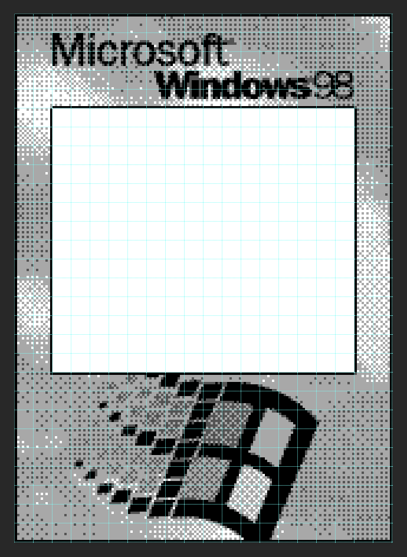
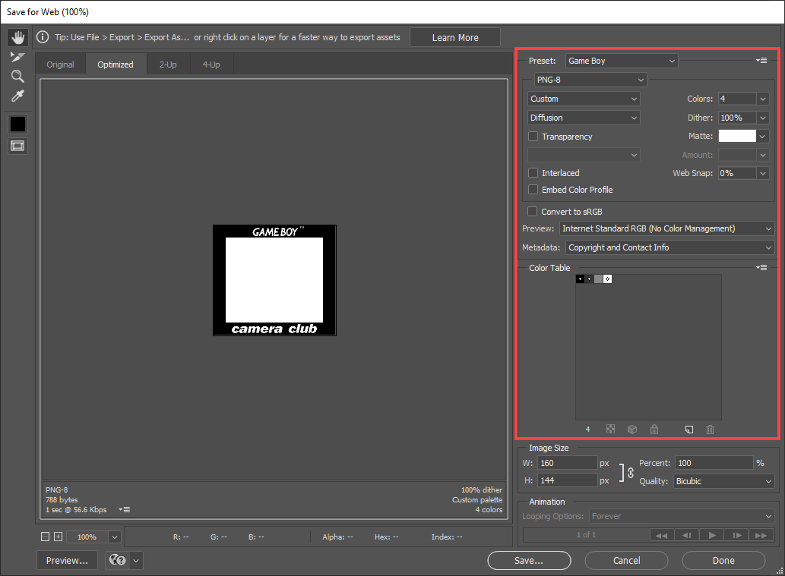
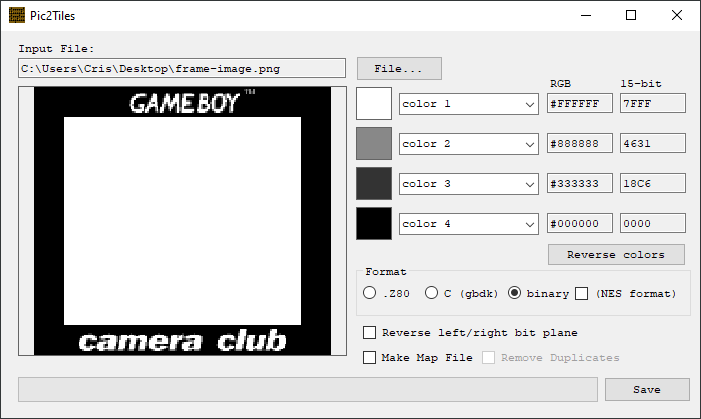

# Game Boy Camera frame replacer

Python script to replace the built-in frames in the Game Boy Camera rom with your own!

## Requisites
This script requires the following Python libraries:
```
python -m pip install --upgrade Pillow
python -m pip install --upgrade img2gb
```
## Usage
```
usage: gbc-fr.py [-h] --mode {copy,inject}
                  --frame-type {standard,wild}
                  --source-rom src.gb --source-frame [1-18]
                  --source-image frame.png
                  --target-rom trgt.gb --target-frame [1-18]

arguments:
  --mode, -m {copy,inject}

  --frame-type, -ft {standard,wild}

  --source-rom, -sr src.gb
    source rom to get data from in copy mode

  --source-frame, -sf [1-18]
    frame number from source rom, standard:[1-18] wild:[1-8]

  --source-image, -si frame.png
    source image for inject mode (.png, .bmp or already formatted tile data .bin)

  --target-rom, -tr trgt.gb
    target rom file to be modified with changes

  --target-frame, -tf [1-18]
    frame number from target rom, standard:[1-18] wild:[1-8]
```

Two modes are available copy or inject.

Copy allows taking frame data from one rom file and pasting into another. You specify the source rom and source frame as well as target rom and target frame.

**Copy Example**: Copy wild frame 2 from Japanese Pocket Camera rom onto the International rom, replacing wild frame 4.
```
python gbc-fr.py -m copy -ft wild -sr pocketcam-jp.gb -sf 2 -tr gameboycam-intl.gb -df 4
```

Inject allows using a completely new image to replace an existing frame. You can specify the source image as a .png, .bmp and it will be converted to tile data or you can provide already formatted tile data as .bin. You will also specify the target rom and target frame.

**Inject Example**: Load tile data from supplied image onto the International rom, replacing frame 7.
```
python gbc-fr.py -m inject -ft standard -si cameraclub.png -tr gameboycam-intl.gb -df 7
```

## Designing your frame image
Game Boy Camera standard frames can use up to 96 unique tiles but a frame is made up of 136 tiles so you will need to re-use or pattern some tiles. When designing your frame, you can show a grid to be aware of how many unique tiles you've used up. The script will ignore unique tiles after hitting the 96 tile limit and will re-use the last tile. The example below uses just 46 unique tiles and a re-used black tile for the rest of the frame.

*Standard frame dimensions 160px × 144px*


Wild frames don't share the same limit and can use all unique tiles across the entire image.

*Wild frame dimensions 160px × 224px*



***Design Templates***:

[Standard frame PSD Template](docs/standard-frame-template.psd?raw=1)

[Wild frame PSD template](docs/wild-frame-template.psd?raw=1)

## Saving your frame image
Make sure to save your image reduced down to 4 colors, this is necessary to convert to 2bpp Game Boy tile format well. **Ensure your 4 shades have good contrast or the converted result will appear washed out and may use less than 4 colors.**


## Converting your frame image
This script uses img2gb library to convert .png and .bmp source images to tile data but if you prefer to do the conversion yourself for better control over the result, you can do so using a utility like [Pic2Tiles](http://www.budmelvin.com/dev/index.html)


## Usage
Your modified ROM will load into emulators but may show a warning about incorrect checksum. Eventually, your rom can be loaded onto a custom flashable Game Boy Camera cartridge once it becomes available.

## Notes
This script will also patch your rom to expose all 8 available wild frame slots. The Japan region PocketCamera normally only exposes 6 wild frames and the international region Game Boy Camera only exposes 7.

## Credits
Thanks to @jkbenaim for their [gbcamextract](https://github.com/jkbenaim/gbcamextract) program which helped to figure out the frame data and tile map addresses.

Thanks to @flozz for their [img2gb](https://github.com/flozz/img2gb) library which provides tile conversion for this script.